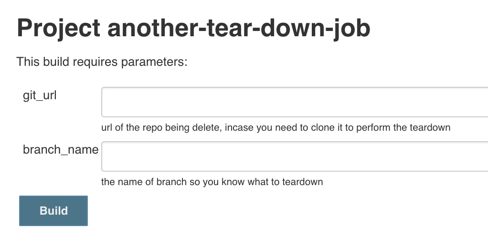
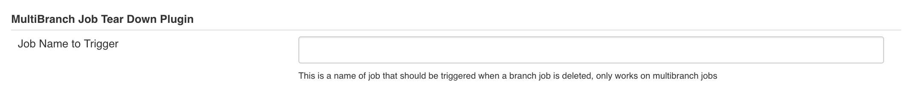

# Multibranch Tear Down

[](https://ci.jenkins.io/job/Plugins/job/multibranch-job-tear-down-plugin/job/master/)

This plugin triggers/schedules a job to run when a multibranch pipeline
job is disabled or deleted. Essential use case is you have a multibranch
job that spins up some infrastructure like a server, when the job is
deleted this plugin enables you to tear down said infrastructure and
clean up after yourself.

## Basic Setup

There are three ways to use this plugin, but they require that you create
a job that accepts a String parameter of `git\_url` and
`branch\_name`.



### Express Setup

Simply create a job named `job-tear-down-executor` the plugin
automatically detects if this job is present and will send all branch
deletions to this job.

### Configure the Job

In the global setting section of Jenkins you can configure the job name
that should be executed if you don't want to call your job
`job-tear-down-executor`.



### Customize for your pipeline

If you need more fine tune control of which job to execute you can
include the following in your pipeline.

**Pipeline Example**

```groovy
//Scripted Pipelines
properties([branchTearDownExecutor('my-special-job')])

//Declarative Pipelines
options {
  branchTearDownExecutor 'my-special-job'
}
```

## License

See [LICENSE](LICENSE).
